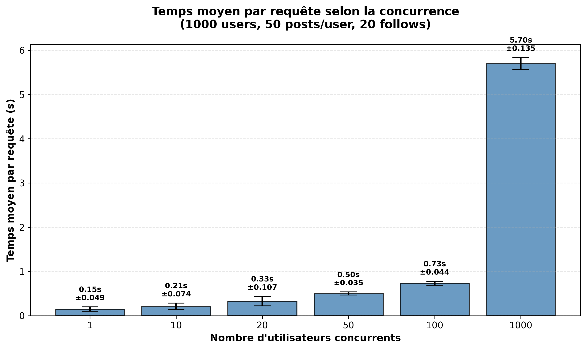
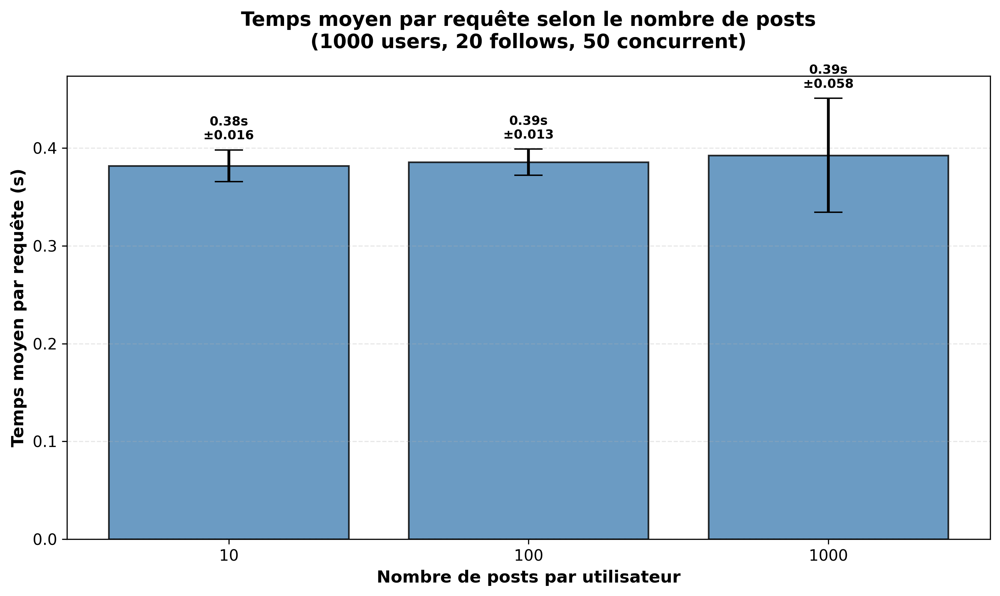
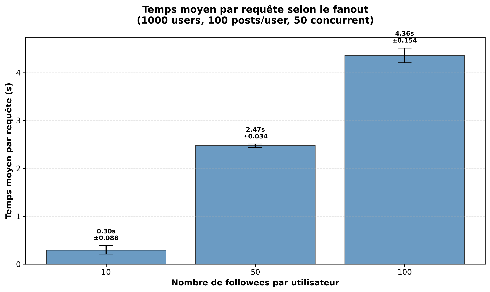

# TinyInsta Performance Benchmark 📊

Educational project benchmarking a social network application (TinyInsta) on Google Cloud Platform under various load conditions.

**Live Application:** https://tinyinstagramtp1dm.ew.r.appspot.com/api/timeline?user=user1&limit=20

---

## Quick Start

### Prerequisites

```bash
# Authenticate with GCP
gcloud auth application-default login
export GOOGLE_APPLICATION_CREDENTIALS=~/key.json
```

### Benchmark Workflow

**Before each experiment:**

1. **Clear database**
   ```bash
   python3 delete.py
   ```

2. **Reset indexes**
   - Delete all indexes on [Datastore Console](https://console.cloud.google.com/datastore/databases/-default-/indexes)
   - Recreate: `gcloud datastore indexes create index.yaml`
   - Wait for status `READY`: `gcloud datastore indexes list`
   - Delete all database content using `delete.py` if needed.

3. **Populate database**
   ```bash
   # Fast version (recommended)
   python3 seed_improved.py --users 1000 --posts 100000 --follows-min 20 --follows-max 20 --batch-size 500
   
   # Standard version
   python3 seed.py --users 1000 --posts 100000 --follows-min 20 --follows-max 20
   ```

4. **Run benchmark**
   ```bash
   python3 scriptStep1.py  # Experiment 1: Concurrency
   python3 scriptStep2.py  # Experiment 2: Posts scaling
   python3 scriptStep3.py  # Experiment 3: Fanout scaling
   ```

5. **Generate graphs**
   ```bash
    python3 concToGraph.py 
   ```

---

## Experiments

### 1. Concurrency Scaling
**Fixed:** 1000 users, 50 posts/user, 20 follows  
**Variable:** Concurrent users (1, 10, 20, 50, 100, 1000)

### 2. Data Size Scaling
**Fixed:** 1000 users, 20 follows, 50 concurrent  
**Variable:** Posts per user (10, 100, 1000)

### 3. Fanout Scaling
**Fixed:** 1000 users, 100 posts/user, 50 concurrent  
**Variable:** Followees per user (10, 50, 100)

---

## Results

### Experiment 1: Concurrency

Before running the experiment, execute:

```
python3 seed_improved.py --users 1000 --posts 50000 --follows-min 20 --follows-max 20 --batch-size 500
```

### Graphs result :



### Experiment 2: Posts Scaling

Before running each test, execute:

- For 10 posts/user:

```
python3 seed_improved.py --users 1000 --posts 10000 --follows-min 20 --follows-max 20 --batch-size 500
```

- For 100 posts/user::
```
python3 seed_improved.py --users 1000 --posts 100000 --follows-min 20 --follows-max 20 --batch-size 500
```

- For 1000 posts/user:
```
python3 seed_improved.py --users 1000 --posts 1000000 --follows-min 20 --follows-max 20 --batch-size 500
```

### Graphs result :



### Experiment 3: Fanout Scaling

Before running each test, execute:

- For 10 followees/user:
```
python3 seed_improved.py --users 1000 --posts 100000 --follows-min 10 --follows-max 10 --batch-size 500
```

- For 50 followees/user:
```
python3 seed_improved.py --users 1000 --posts 100000 --follows-min 50 --follows-max 50 --batch-size 500
```

- For 100 followees/user:
```
python3 seed_improved.py --users 1000 --posts 100000 --follows-min 100 --follows-max 100 --batch-size 500
```

### Graphs result :



---

### Additional Notes : 

A faster database population script is available: `seed_improved.py`

A script to delete the entire database is available: `delete.py` 

All the result are avaible on the folder `outAsynch`


