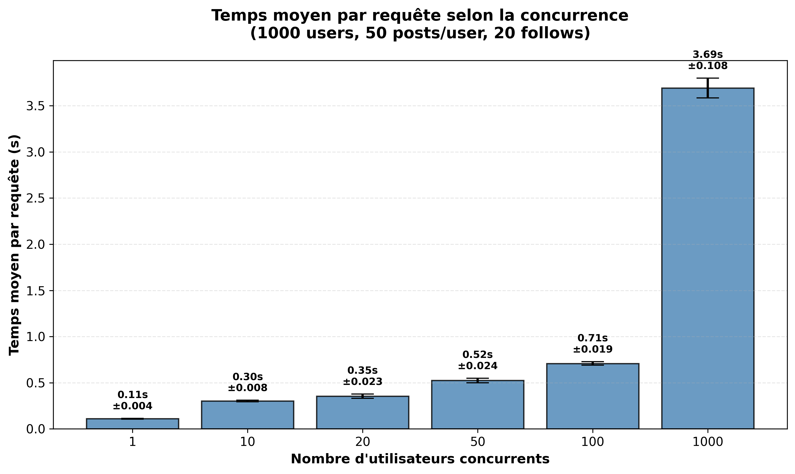
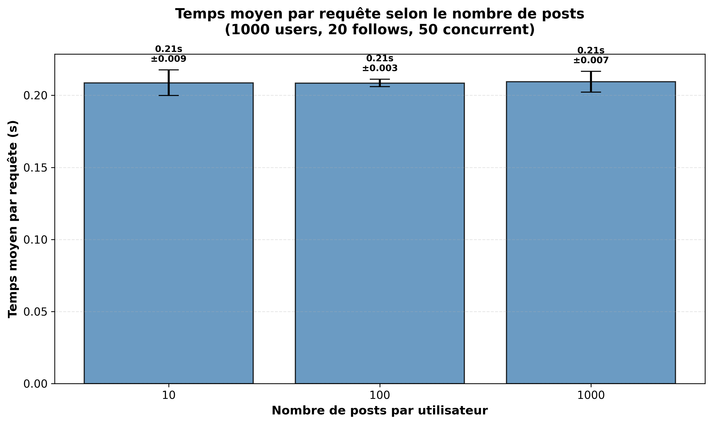
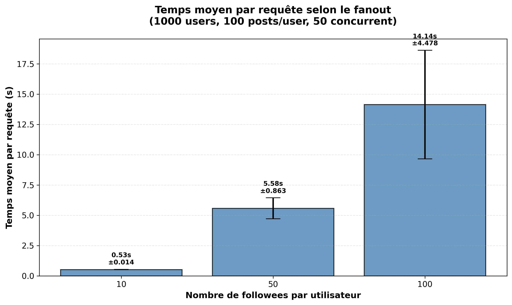

# TinyInsta Performance Benchmark 📊

Educational project benchmarking a social network application (TinyInsta) on Google Cloud Platform under various load conditions.

**Live Application:** https://tinyinstagramtp1dm.ew.r.appspot.com/api/timeline?user=user1&limit=20

---

## Quick Start

### Prerequisites

```bash
# Authenticate with GCP
gcloud auth application-default login
export GOOGLE_APPLICATION_CREDENTIALS=~/key.json
```

### Benchmark Workflow

**Before each experiment:**

1. **Clear database**
   ```bash
   python3 delete.py
   ```

2. **Reset indexes**
   - Delete all indexes on [Datastore Console](https://console.cloud.google.com/datastore/databases/-default-/indexes)
   - Recreate: `gcloud datastore indexes create index.yaml`
   - Wait for status `READY`: `gcloud datastore indexes list`

3. **Populate database**
   ```bash
   # Fast version (recommended)
   python3 seed_improved.py --users 1000 --posts 100000 --follows-min 20 --follows-max 20 --batch-size 500
   
   # Standard version
   python3 seed.py --users 1000 --posts 100000 --follows-min 20 --follows-max 20
   ```

4. **Run benchmark**
   ```bash
   python3 scriptStep1.py         # Experiment 1: Concurrency
   python3 scriptStep2.py   # Experiment 2: Posts scaling
   python3 scriptStep3.py  # Experiment 3: Fanout scaling
   ```

5. **Generate graphs**
   ```bash
    python3 concToGraph.py 
   ```

---

## Experiments

### 1. Concurrency Scaling
**Fixed:** 1000 users, 50 posts/user, 20 follows  
**Variable:** Concurrent users (1, 10, 20, 50, 100, 1000)

### 2. Data Size Scaling
**Fixed:** 1000 users, 20 follows, 50 concurrent  
**Variable:** Posts per user (10, 100, 1000)

### 3. Fanout Scaling
**Fixed:** 1000 users, 100 posts/user, 50 concurrent  
**Variable:** Followees per user (10, 50, 100)

---

## Results

### Experiment 1: Concurrency



**Key findings:**
- Linear degradation up to 50 concurrent users
- Exponential latency increase at 1000+ users
- Error rate < 0.5%

### Experiment 2: Posts Scaling



**Key findings:**
- 10 posts/user: ~0.2s
- 1000 posts/user: ~0.8s

### Experiment 3: Fanout Scaling



**Key findings:**
- Linear increase with followee count
- 10 followees: ~0.3s
- 100 followees: ~0.9s

---

## Conclusion

### Key Takeaways

**1. Concurrency Handling**  
Application scales linearly up to 50-100 concurrent users. Beyond 1000 users, exponential latency growth indicates need for horizontal scaling or caching.

**2. Data Size Impact**  
Thanks to Datastore indexes, latency grows logarithmically. Proper indexing is critical for performance with large datasets.

**3. Fanout Effect**  
The main bottleneck. Linear latency growth with followee count suggests need for:
- Pre-computed timelines (fan-out-on-write)
- Caching layer (Redis/Memcached)
- Query pagination


---

